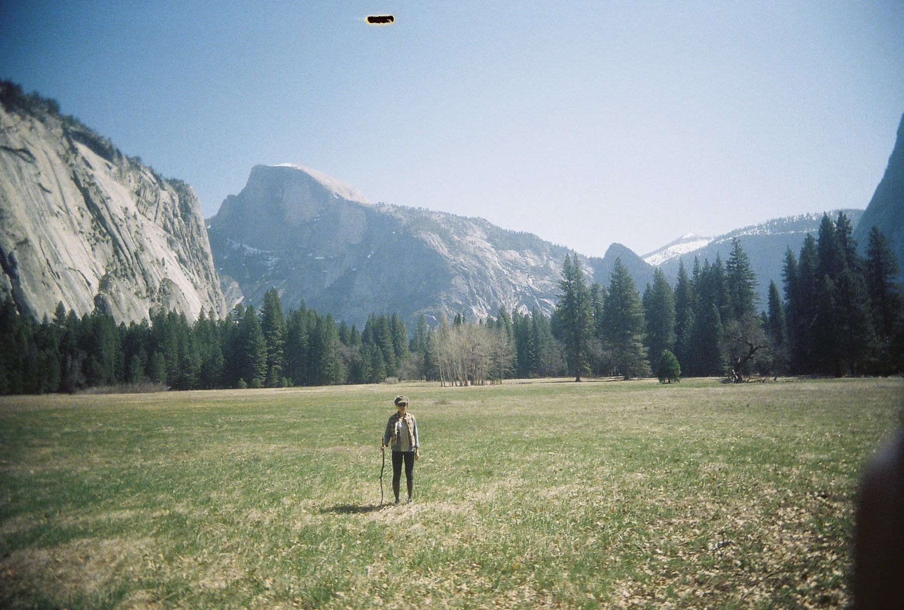

# About

Angel Yoon Kyung Cho, 조윤경,  is a Korean-American designer and artist interested in exploring the self and society through her creative practice.

Born in South Korea and raised between two countries, she grew up immersed in traditional Eastern and modern Western cultures. Interested in social psychology and art from an early age, she decided to study graphic design at the Rhode Island School of Design. This lead to her career in working for graphic design consultancies, teaching typography, and most recently, creating engaging interactive experiences for exhibition spaces.

Parallel to her design career, Angel pursued less conventional paths in meditation and pottery. She studied under potters in Okinawa, Japan, and in the Blue Ridge Mountains of North Carolina. She also formed a practice in zen meditation and the Japanese Tea Ceremony while living in a Buddhist Monastery in Northern California. She continues to find ways to weave these practices into her creative work.

Angel is currently based in Barcelona, Spain, pursuing her Masters in Design for Emergent Futures at the Institute for Advanced Architecture of Catalonia.

Lorem ipsum dolor sit amet, consectetur adipiscing elit **[my website](https://www.angeljodesign.com)**
