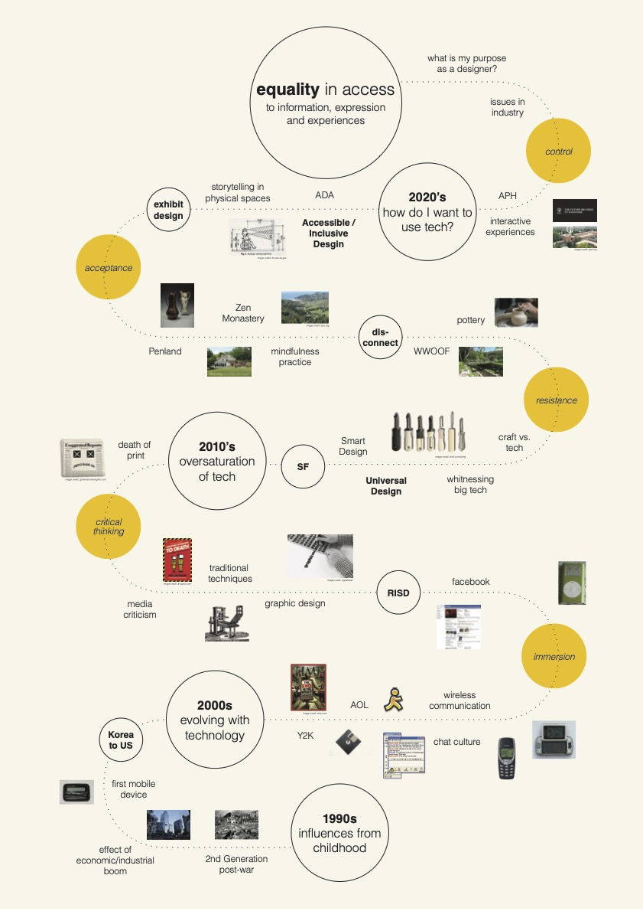
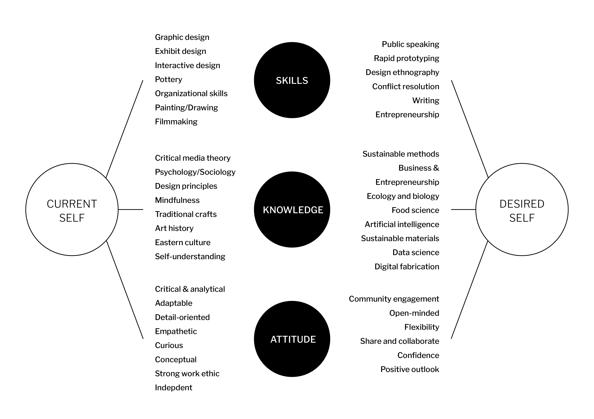
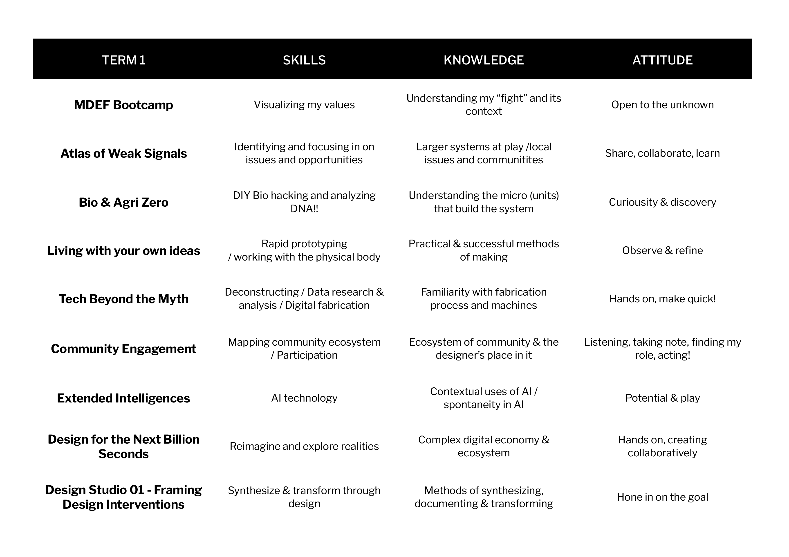

---
hide:
    - toc
---

# Bootcamp
04-08 October 2021

<h2>Explorations</h2>

1. What is my fight?
2. Hybrid Profiles
3. Personal Development Program

<h2>Reflections</h2>

<h3>What is my fight?</h3>

In our first week of MDEF program, we met the faculties, visited the facilities and the Poblenou neighborhood, and was introduced to the structure of the program. Our first exercise was to reflect on the question "What is my fight?" and create a poster to share with the group.

In my poster, I visualized my journey through my personal and professional life in the context of technology. I chose the lens of technology because it had and continues to have a large impact it on my personal life, our culture and society, my design career, and our collective future. In summary, I grew up with the evolution of technology and the internet and have had very mixed feeling about the ethics of technology. At different times of my life, I embraced and rejected working with or buying into the culture of tech, but have now come to a place where I see technology as a tool I must understand and manipulate to make impact in the future. And I believe the best way technology has made an impact in our society is through elevating equality; by providing new opportunities and access to marginalized communities and individuals who may not have had access before.

<h3>Hybrid Profiles</h3>

We learned about designing from a first person perspective and the importance of engaging with community early on in our design process. The sample (India light) project project was a great example of how as designers, we are often "solving" design problems in our own heads and ultimately designing for ourselves instead of the actual client or audience. We often fall into the trap of seeing ourselves as creators and problem solvers and the world as a big problem we need to solve. When the reality is that our minds our limited and the connections and sparks we can generate through real-life engagement and interactions (people, places and things), can provide a depth of understanding, relevance, and unimagined pathways that we could not have thought of alone.

<blockquote> "The professional identity is deduced from the role you typically take in a design process, your strengths and weaknesses as a designer. Your professional identity is constantly developing." - Oscar Tomico
</blockquote>

Following this lecture, we learned about the importance of understanding ourselves (our skills, knowledge and attitudes) on a professional level, and our aspirations. We jotted down our professional identities, then shared our qualities with our classmates, one on one. With each share, I learned a new quality of a classmate and picked up a quality that I would like to have. This exercise provided a good platform to share about ourselves in ways that we normally wouldn't.

<h3>Personal Development Program</h3>

We also applied this method to our term one course list, and reflected on what skills, knowledge and attitudes we would like to acquire through each course. There are many topics in term one I am curious and excited to learn about. It will be interesting to return to this chart in hindsight and compare notes with my learnings.

<h2>Next Steps</h2>

- [ ]  Share and communicate professional identities and aspirations with others
- [ ]  Continue to explore my fight and what I want to pursue
- [ ]  Revisit and connect with Poblenou communities

<h2>Resources</h2>

- Rural Spark (1PP)
- Poblenou Urban District
