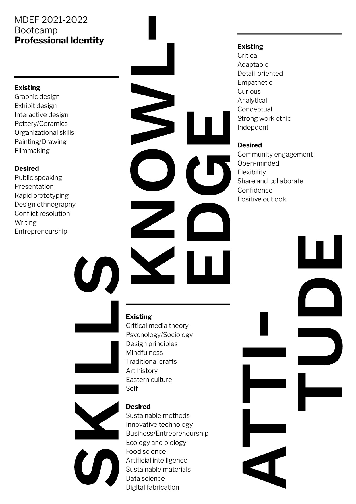
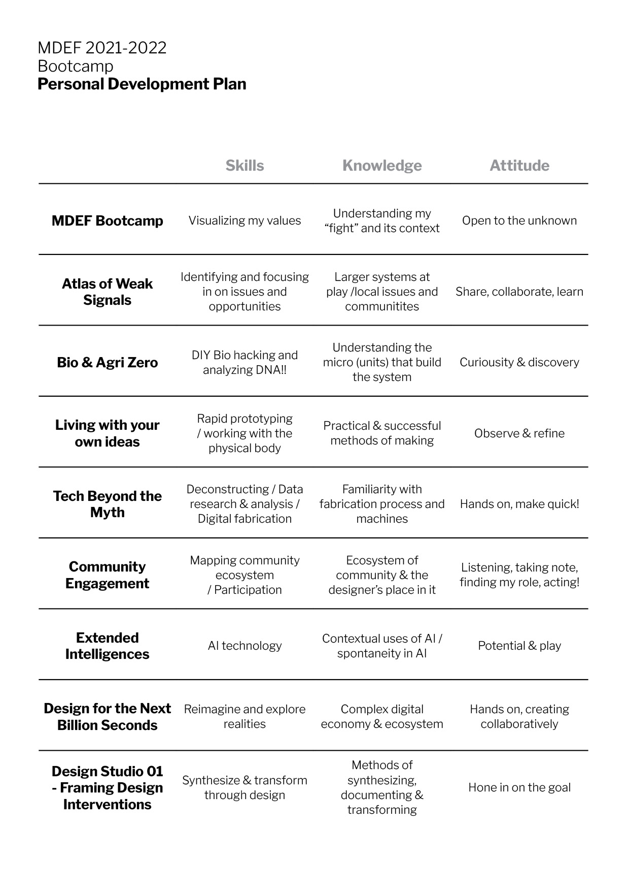

---
hide:
    - toc
---

# Bootcamp
04-08 October 2021

This first week of MDEF Bootcamp was an introduction of faculties, facilities, neighborhoods, communities, and the structure and ideologies of the course.

<h2>What is my fight?</h2>

Through the prompt, "What is my flight?", we reflected on topics and issues we cared about and want to explore further during our time here at MDEF. My process of thinking about this, I thought of my journey of coming here and joining this program. I listed down all of my influences and reflections since I was small and how that contextualizes my identity, my values, and the my thinking process.

This map shows my relationship to technology in a linear journey from childhood (early 90's) to today (2021). I decided to focus on my relationship to technology because I realized that it really shaped my life in different ways, and continues to shape my life and our collective lives. Although it's not necessarily "my fight" to think about technology, it was a good exercise in helping me come closer to what I might want to pursue.

The best use of technology is for equality and providing tools of expression, communication, health, etc. to marginalized groups and individuals that may not have previously had access.

<h2>Professional Identity</h2>

Existing skills vs. desired skills / group exercise in class helped hone in on what qualities and skills I'd like to grow... 

<h2>Professional Development Plan</h2>

How can I use this information to plan out my goals?

<h2>Notes</h2>

Designing with a First Person Perspective (1PP)
