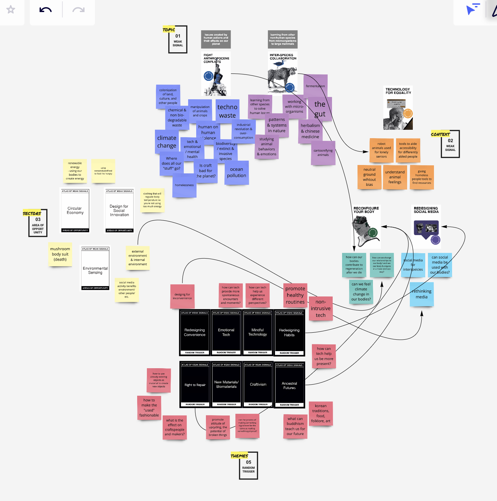
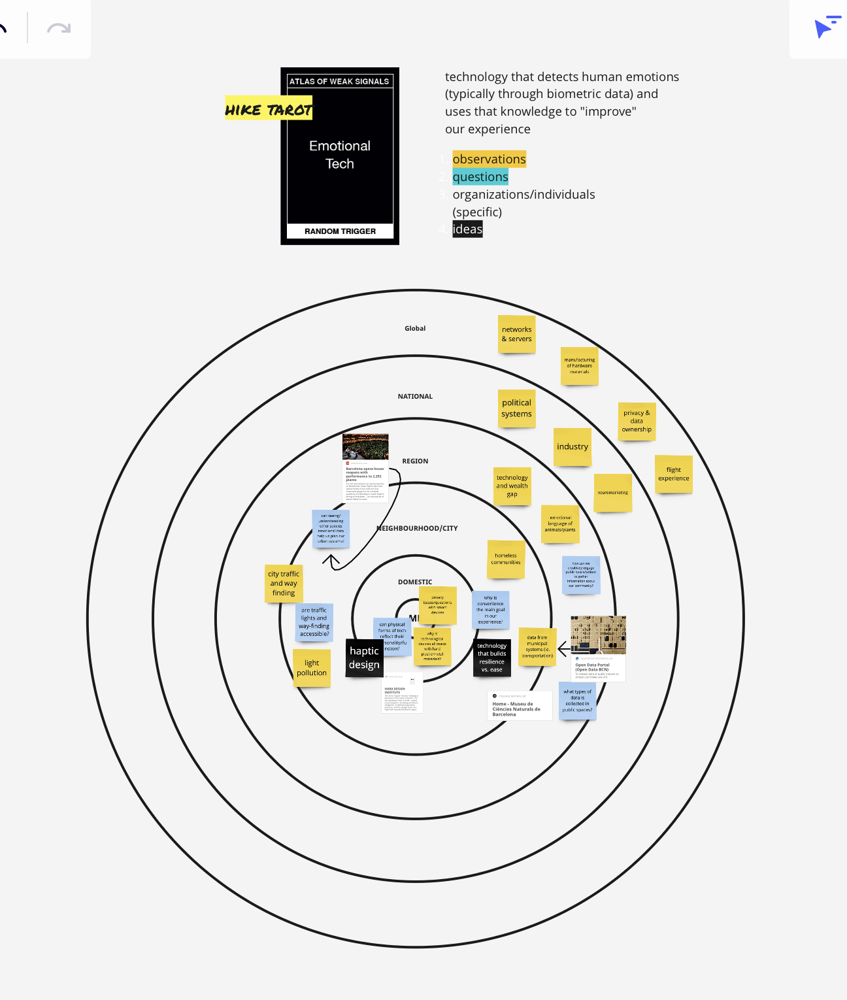
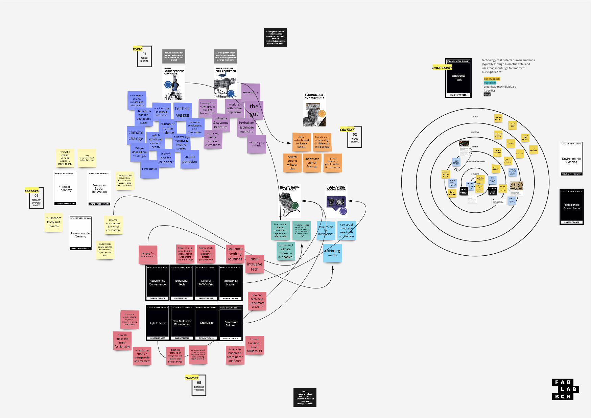
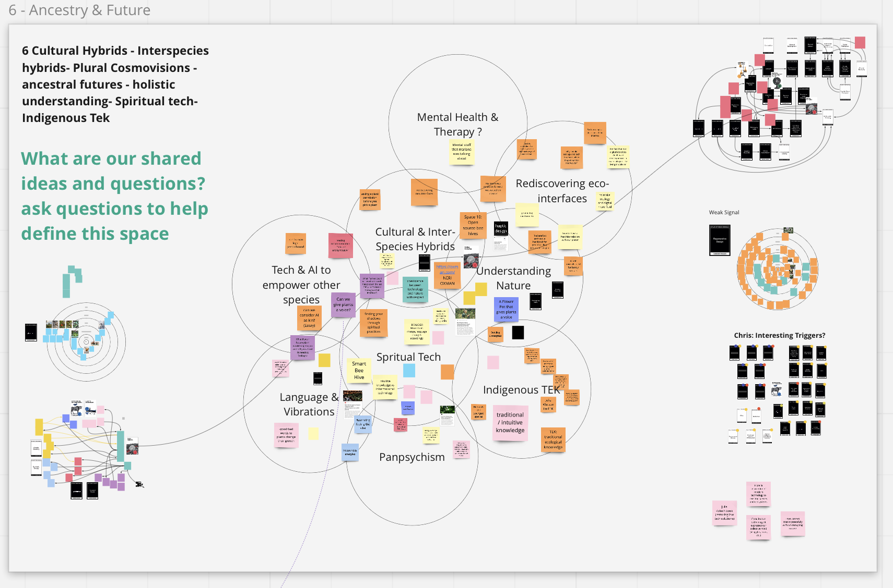

---
hide:
    - toc
---

# Atlas of Weak Signals
11-15 October 2021
lecturer: Mariana Quintero

## Explorations

1. The Future
2. Design Space
3. Multi-scalar Diagram

## Reflections

### The Future

Mariana opened this this week's course with the enticing phrase, **"Today we are going to talk about the future"**, and all of the baggage that comes along with it. Who are we? Which future? What are we talking about? Listening to Mariana's personal journey, I resonated with her insight in discovering human metaphors behind all aspects of technology. The example of the ancient memory board artifact was fascinating to see because the layout of the board and the concept behind it is so similar to the circuit boards we make today. It made me feel humble and a part of something larger, in an ancestral lineage of humans that are desperate to create and preserve their stories.

<blockquote>"Cognitive ecologies instead of cognitive supremacies" - Mariana Quintero</blockquote>

### Design Space

We were introduced to our design spaces on Miro, a working space we will be using throughout the program to map out our ideas, findings, experiments, and feedback. We started getting acquainted with this space through a card game. We had to pick a topic card we cared about, then blindly select a series of other topic cards, and create meaningful connections between the cards. Having the pre-written cards were helpful in giving form to abstract ideas. I enjoyed the format of the game, and thought it was a great way to engage and teach a system.

On day 2 we went on a hike in Collserola Natural Park, on the outskirts of Barcelona. We were prompted to picked a card to take with us and reflect on during our hike. I chose "Emotional Tech". I've always seen this "green area" on google maps, but haven't made it out there yet so was excited to explore. Our early morning hike was full of surprises; we explored unmarked trails, tasted wild berries, identified new plants, exchanged ideas, walked in silence, and received a great talk from a park ranger at the peak of our hike. Some reflections from our conversation:  

- Relationship of the city to the forest. Living in a capitalistic society, we have the tendency to want to build, expand, and grow our citites. But how does this affect the ecosystem and other species that have previously lived in the urban areas or currently live around it?
- The significance of seeing something vs "nothing"; for example a forest vs a field. I had never thought about the importance of visual scale in determining our values in this way. The park ranger brought up the topic of humans building on empty fields because they see the empty land as an opportunity to "build on". In contrast, a forest full of trees and larger species is seen as something to be saved or preserved. But what we don't realize is that ecosystems and other organisms like birds depend on fields to feed and survive.
- How can we discourage people from moving to cities? This was an interesting topic to have post covid, when our view of workspace and home space have shifted tremendously. In the past year, many people have already migrated to the countrysides seeking nature, more space, and since remote work became a long-term possibility.

### My card: Emotional Technology

I chose this card because the words resonated with me, but I didn't actually know its official meaning. After doing some research, I learned that Emotional Tech refers to technology that recognizes and uses human emotions (usually through biometric data) to improve their outputs and services. Some reflections I had during my day with this card:

- Can we use the input as emotions from other species besides humans? Shift the human-centered perspective
- How can emo tech improve our relationship with our surroundings
- The ways we relate to each other in a city environment
- What do we mean when we say "better" experience or world. Do we define "better" as easier or more convenient? If everything is more convenient, are we missing out on the revelations and discoveries that inconvenience and random curve balls life throws us?

### My Design Space

Having so many great options, it was difficult to choose a few cards that represented my pursuit. I definitely resonate with the "hotel buffet syndrome" as Mariana calls it. But I tried to remember to trust my instincts and make intuitive decisions.

I chose the cards "Fight Anthropocene Conflicts" and "Inter-species Collaboration" because I'm interested in the human-ness of these issues and also exploring other perspectives outside of the human species.

In our collaboration exercise, was good to hear other's perspectives. I feel like we spent most of the time trying to negotiate our definitions of the group. Everyone had something slightly different in mind and wanted to get on the same page. I think it's really difficult to let go of your personal identity or ideas esp in this world today where our identities are... It reminds me of a zen story: when a group of hippies arrived at the San Francisco Zen Center in the 70's, the senior monk, Suzuki Roshi told them to get out of their individual clothing and and accessories and change into shaved heads and black robes. That when they all had

## Questions

1.

## Action Items

- [ ]  Contact: Marta Gonzales (Elisava Researcher) and ask about research process and relevant topics
- [ ]  Experiment: Google translate graffiti in Barcelona
- [ ]  Experiment:
- [ ]  New PDP Skill: Community organization

## References

- The World of Digital Art
- Designing Reality
- Aeon "Reeling in Sith"
- Kiss the Soil
- Ancient memory board
