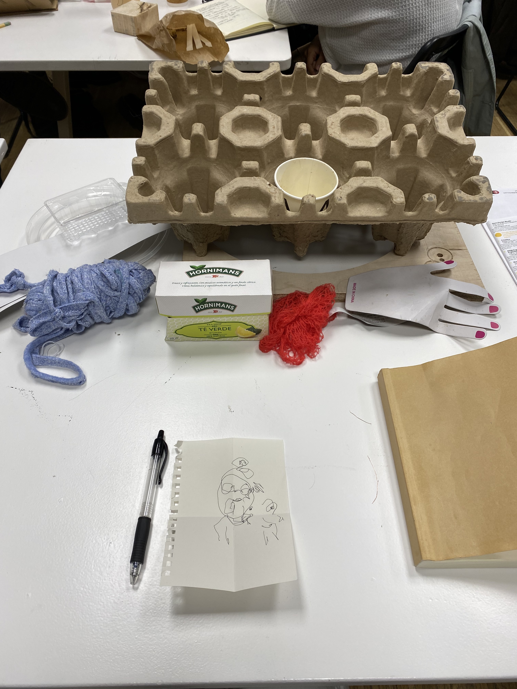
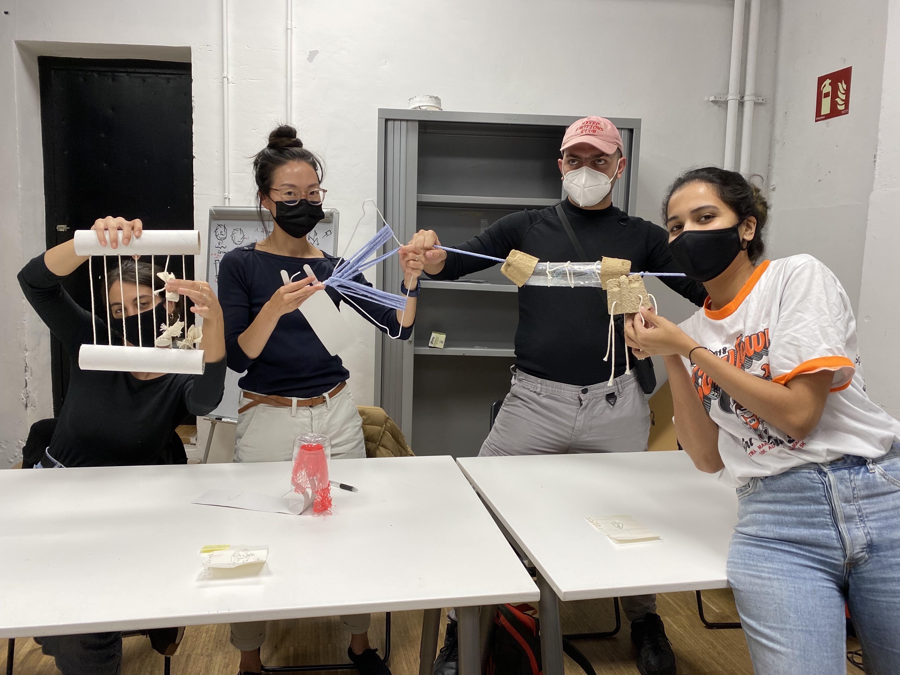
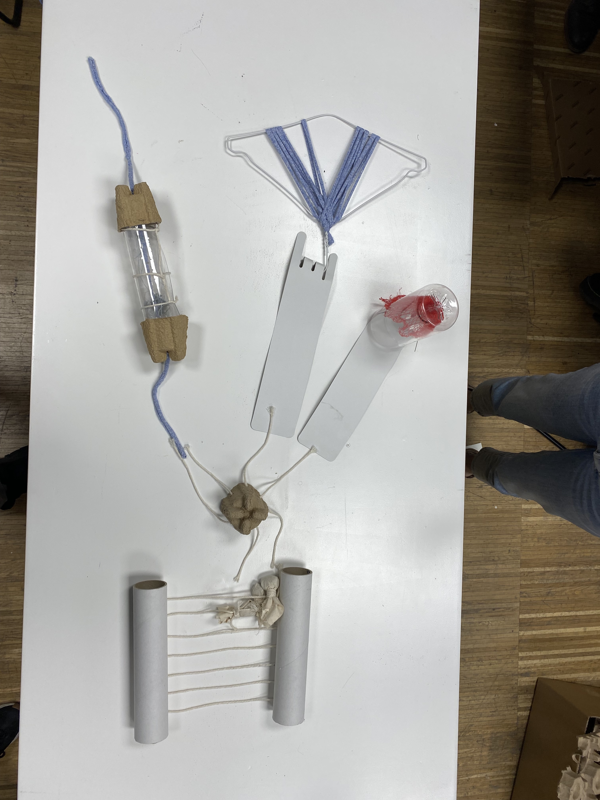
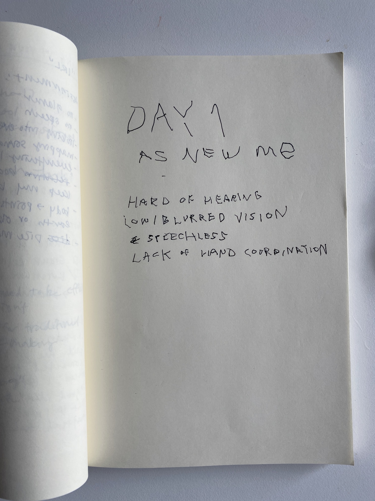
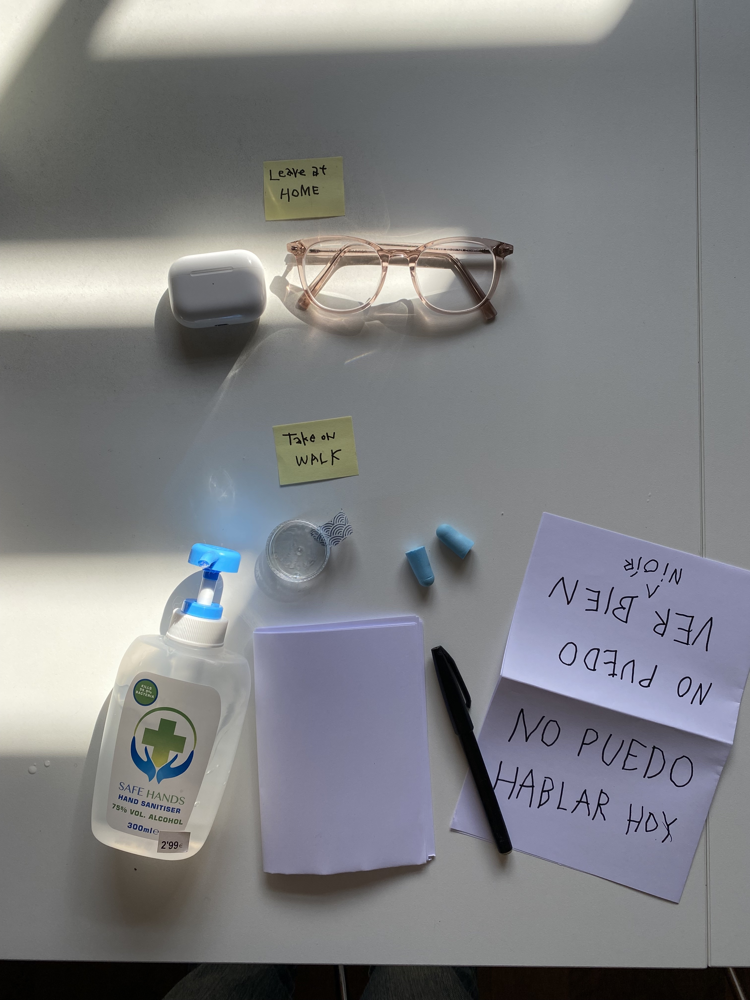
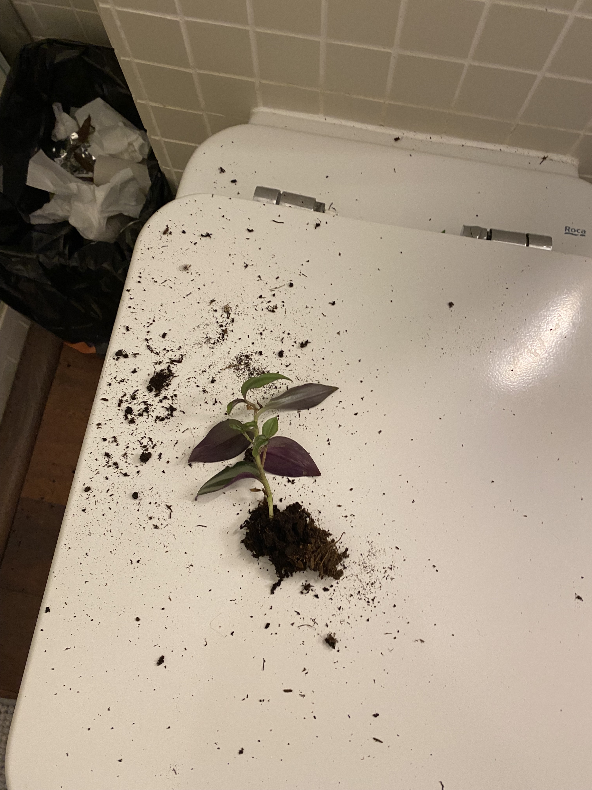
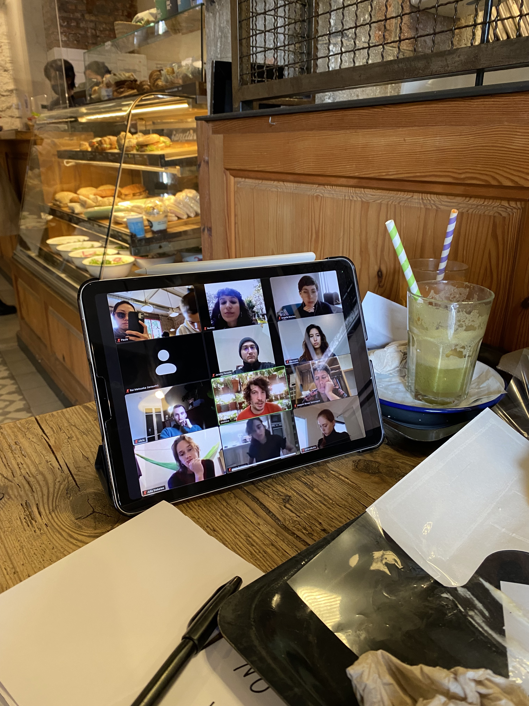
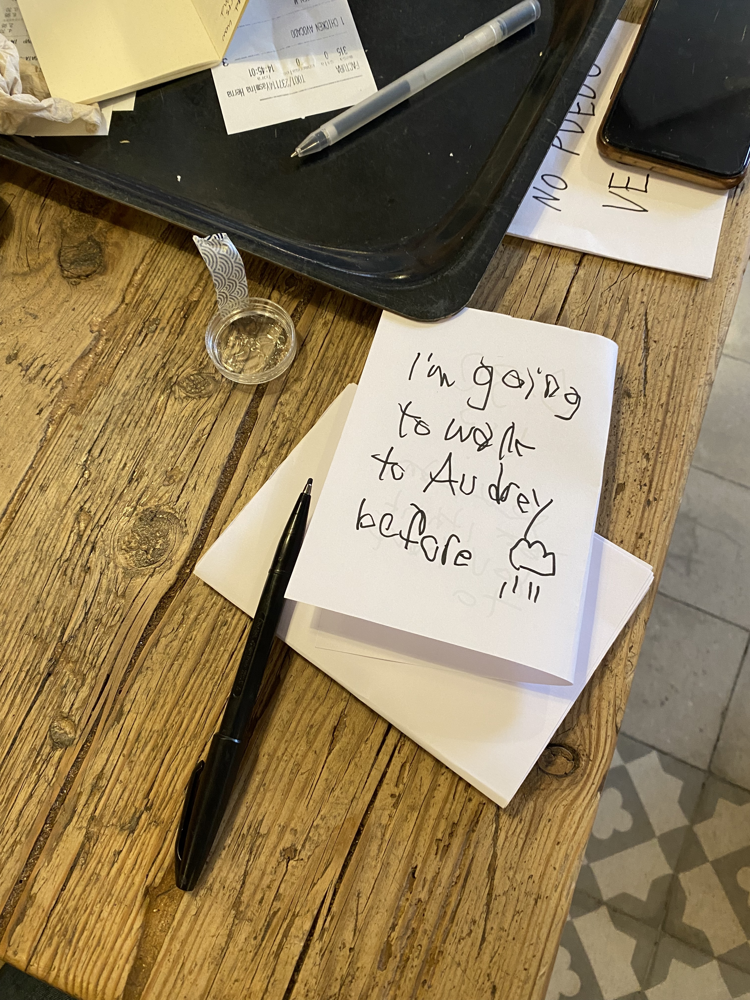
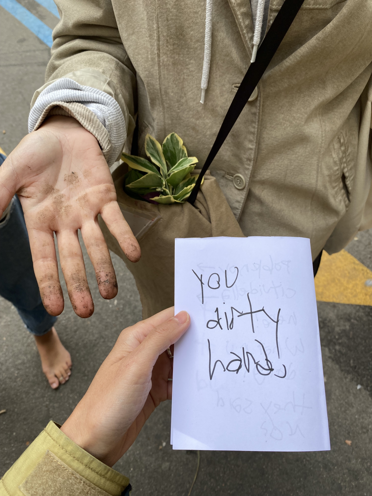

---
hide:
    - toc
---

# Living with Your Own Ideas
*Week 5 / 02-05 November 2021 / Oscar Tomico , Kristina Andersen, Angella Mackey*

## Workshop
1. Take one minute to draw a self portait on a small piece of paper. Then fold the paper and put it in your pocket.
2. Make something out of the scrap materials I brought to class for the person I drew. It can be for any function.

### Reflections
We started working with materials before having an idea of what it would become. I had explored this mode of making before (in undergrad and in my design residency) and felt comfortable and ready to jump in.

A few of the scrap materials I brought were: fabric yarn, clothes hangar, a net bag used to hold bell peppers from the grocery store, cardboard, a plastic bottle, and tea bags [*Fig.1*]. I gravitated towards the net bag and the fabric because they were flexible (and colorful) materials and I started wrapping them around different objects [*Fig.4*]. I enjoyed how the flexible materials were able to shift forms and create variations within the same object. I decided to focus on this element of "variations" in output with a common input.

I reflected of the 1 minute self portrait I had drawn, which I drew with my non-dominant hand and my eyes closed (so I can better connect with my true self, and also because I can't see myself anyways). The outcome of this drawing was a rough outline of my head with all of my features (eyes, nose, and mouth) drawn outside of my head [*Fig.2*]. I decided this person didn't use speech or sight to communicate, and that I needed to build a tool for them to communicate with touch.

In the end, I came up with two simple tools: the first one using the red net, paper clip, and a plastic bottle, and the second one using a clothes hanger and fabric yarn [*Fig.5*]. Both of these objects you can interact with and transform the shape of the materials in different degrees and variations, similar to variations in sound for speech. Within my system, tactile variations of the object will determine the message I was communicating. For example, depending on how far the clothes hangar was stretched and how far the yarns are spaced out, it would communicate a message.

We also realized as a group, our machines each touched upon a different human sense [*Fig.6*]. In her feedback, Kristina observed themes our group had in common were "becoming" and "unfinished explorations". I resonated with this comment because what we had made seemed to reflect our aspirations more than a tool that would be useful.

*Figure 1*

*Figure 2*

*Figure 3*

*Figure 4*

*Figure 5*

*Figure 6*

*Figure 7*

## The New Me
1PP one day experiment

###Goal:
With an interest in accessibility in design, I wanted to gain first-hand insight into how accessible a daily life in Barcelona is for people with disabilities. To challenge myself, I committed to spending a day without speech, blurred vision, hard of hearing and poor manual dexterity. I hoped this experience would give me a small insight into understanding into the specific conveniences and inconveniences (in technology, human interaction, social transactions, navigations, etc.) in daily life in a city for people with disabilities. Here are ways I modified my senses for the day:

1. **Low, blurred vision**
    I have poor vision (nearsighted) and always wear glasses to be able to see clearly. My vision on both eyes are around -3.5, which means the words I'm typing on my computer screen start to get blurry if I sit straight up on my chair (1ft away). The further away something is from me, it is more blurred and less defined.
    *For recordings I made, I used hand sanitizer on a clear plastic container lid and taped it to my phone camera lens to simulate what I was seeing (actually a bit worse)*

2. **Hard of hearing**
    I used earplugs in both of my ears to block out loud noises. (*"earplugs typically have an NRR between 22 dB to 33 dB." - sleep foundation.org)*

3. **Without Speech**
    Committing to not speaking today. I have a feeling this sense will be the easiest transition for me, especially when I am alone and in a foreign country. I will need to challenge myself by inserting myself into social environments where speech is necessary.

4. **Lack of Hand Coordination**
    Using my non-dominant hand (left) to write today.

    

### Field Notes:

    **9:44am** — I couldn't see my cat, Chicken, anywhere around our apartment and thought he could have jumped off the balcony. So I got scared and I started running to the corners of our small apartment looking for him. I really wanted to call out his name ****like I usually would when I can't find him. He doesn't always respond, but still it's something you do when you lose something that can hear. Since my sight wasn't good, I couldn't see very clearly in the dark closet and under the bed, and had to feel around with my hands. I thought I need to make a sound that would be appealing to him, so I went and got out a crinkly cat toy which made a loud noise. No response. I got a bag of treats and shook it vigorously (he lives for treats), no response. I became frustrated I couldn't make any sound... But I finally recalled his favorite (my least favorite) napping place, which is a drawer in the bathroom where we keep the fresh laundered towels. And sure enough, there he was. Because I couldn't see well, I touched him to confirm it was him.

    **10:15am** — I heard a noise coming from the bathroom, and I ran there and saw brown stuff on top of the toilet seat, which I knew was dirt (context), and my cat Chicken (oval grey thing), running out of the bathroom. I followed after him and he ran under the bed (because he knew he did something bad). I wanted to scold him and say, "chicken, no! Bad boy!", which is what I usually do when he does something bad, but I couldn't use my voice, so I just slapped the ground with my hand as an expression of my frustration and to make a loud noise for him to hear.

    

    **11:30am** — I realize my home has become too safe, so I decided to go on a walk and expose myself and see what other challenges I run into in the wild. I thought since speech is a very social tool, I needed to engage in social environments. So I texted the MDEF group chat to see if anyone wanted to join me on a walk through the city. Paula, Paula, Georges, and Borka responded. And I planned to meet Georges in Poblenou to start. I will be leaving my glasses home, despite my discomfort, so I can fully commit and not retreat to it when I become uncomfortable.

    

    **13:00h** - Went out of the house to meet Geroge at Iaac. Vision was the sense I was relying on most heavily here. It was difficult trying to avoid stepping on poop on the ground, since I had trouble seeing. Normally, I would cross the street on a red light if there were no cars passing. *I noticed myself relying a lot on other people on the street (since they were large masses and could easily be seen) watching other people to see if I should cross the street on a red light*. I reinserted my ear plugs properly and I can hear significantly less. With my earplugs in, it was harder to identify sounds and the distance of the sounds.

    **13:06h** - Waiting for George outside of Iaac, it’s difficult to see the faces of people who are approaching. I keep looking at them wondering if it’s him, and it probably looks strange. I feel glad I wore my sunglasses, it makes me feel safer and less seen.

    **13:11h** - Ordering coffee. I showed the sign that says "No Puedo Hablar Hoy" and pointed at the word “cortado" on the menu. He understood and gave me a “thumbs up” and proceeded with the transaction as normal but without saying anything. The card reader didn’t work so he banged on the other ones and for some reason I understood that as frustration towards me. This transaction made me self conscious.

    **13:18h** - I start feeling uncomfortable walking in silence and feel like I need to say something. We walk to Cituidella park to meet up with Paula.

    

    **14:40h** - We find a cafe near the Arc de Triumph to grab some food, charge our phone, and join the class online. Ordering food: I get a sense that the workers here do not expect that I cannot speak, hear or see well. When I showed her the sign, I got the sense that she was a bit annoyed. I had to take some time to write what I wanted to order on the piece of paper because I was using my non-dominant hand. She left the counter for a few seconds and then returned when I finished. I showed her the piece of paper to order a sandwich and a juice.

    **15:10h** - We took class on iPad at a cafe. I found myself moving closer to the iPad because I couldn’t hear very well and when people were commenting, I had to move close to see what the text was. Aparna commented on my look through a personal text, which made me feel silly.

    

    **15:30h** - A man came up and asked for something in Spanish, I couldn’t understand but I also couldn’t respond with sound. Helpless I looked at Paula, and she looked up and shook her head and said “no”

    **15:36h** - We decided to head out and walk towards Audrey's kitchen before it starts raining. Being in a busy part of town, we passed by many stores that looked interesting but I couldn’t read the signs, and that *made me frustrated.* Normally, I would look up the store names as I pass by them on my google map and pin them so I can return to them in the future. I felt like I was missing out on future pleasures.

    

    **15:53h** - I asked Paula if the metro ticket was okay (to use for the bus) and she misunderstood me suggesting she uses my metro ticket too. I understood her misunderstanding through what she said, but *I wasn’t fast enough* to communicate this to her by typing it on my phone. I let it go.

    **16:34h** — We are now out in Saint Antoni to come to Audrey’s kitchen. We joined Mariana and Audrey here. With more than one person around, I'm finding it more difficult to insert myself in a group setting. Conversations are happening really fast and reactively, and I'm not finding time for me to chime in.

    

    **16:17h** - I saw Paula touching all of the figs on the table and I wanted to tell her not to touch all of the figs. I couldn't scold her with my voice so I tapped her hands (gently) but firmly, letting her know that it's not okay. It was taken with a sense of humor and we laughed about it. I wrote "you dirty hands" on the piece of paper with my non-dominant hand and showed it to her.

    

    **17:17h** - We decided to go to a bubble tea shop. As we were walking, we lost Audrey and I was the only one who saw her walk the other way. I wanted to yell at her to let her to get her attention, but I couldn’t. Instinctively, I started snapping my fingers like I did with the cats this morning, but it wasn't loud enough. I panicked a little *I felt helpless* and ran towards Paula and marina to tap their shoulders to let them know and they called her. *It was frustrating.*

    **17:25h** - It's 5 minutes before my 1:1 meeting with Angella and the Zoom app on my phone isn't working. Paula, Mariana, and Audrey are inside a boba shop. I hurry in and tap the shoulder of Audrey who is the closest to the door and hand her my phone where I typed "Can I use your phone for the meeting? Mine isn't working". She said her batteries were low and she called out to Marina, who gave me her phone to use.

    **17:30h** - Meeting with Angella. I showed her my sign (in english) and she started writing a sign to show me. I messaged her in chat and told her we should talk in chat for the sake of time, and she asked me if it was okay if others can see it. I said I didn't mind and we continued our conversation through chat. I told her what I was doing and asked her if she knew any American Sign Language. She told me she knew "milk" and "more". She mostly stayed silent and communicated with chat although she was able to speak back to me over the call. At the end of the call she said, "Bye, Marina" and I realized that she had thought I was Marina because I was using her phone. I wasn't quick enough with typing to let her know before I left the call. *I was frustrated that she mistook me as Marina and I felt helpless that I couldn't say anything to correct her misunderstanding.* I decided to deal with it later in an e-mail message.  

    **17:47h** - Ordering boba. This was my third time interacting with a service employee, so I knew exactly what to do. I wrote what I wanted to order beforehand while I stood in line and prepared my credit card and my sign. When I was up to order, I showed my sign "Yo Puedo No Hablo", and he asked me "why?". I didn't expect him to interact with me in this way and I took a moment to write "experiment" (very poorly) with my non-dominant hand. I showed him the word and he gave me a thumbs up. I responded with a thumbs up and showed him the paper with my order on it. He grabbed my paper (which I also didn't expect) and wrote something on it himself. He returned the paper to me and I saw he had written "4.20 Euros", what I owed him. I paid with credit card and went outside to reflect on these few unexpected responses. I typed it out to Audrey and she suggested that he might have been aware that I wasn't actually deaf because she was filming me the whole time. *I hadn't thought about this before. By having someone film me for the final video, I was communicating that this was a set up (inauthentic) experience.*

    **19:00h** - It’s harder to see as it becomes dark and I have my sunglasses on. I chose to keep them on in order to fully commit to my experiment and walked home in the blurry darkness. *I felt significantly less safe, unable to see clearly and hear clearly.* It made me realize how much I rely on these senses for my sense of security.

## Pain Points & Observations:
*What are my major observations and issues that came up today?*

1. The mobile phone was HUGELY useful to me in every aspect during the day. I held it in my hand constantly and used it as a live tool to communicate with the people around me, to enhance and enlarge images that I couldn't see (were too far away), etc. Also, at the sandwich shop, it was hard to see the digital menu that was far away. In this case, I used my mobile phone to view and enhance the images live.
2. I noticed how much I rely on reactive and responsive communication, like sounds of acknowledgement and affirmation. And how much communication is not necessarily about the meat of the content, but all of the "stuff" around it. I noticed myself compensating by nodding a lot and making my gestures larger than usual (to be seen) and also lots of "thumbs up".
3. Getting people's attention. I didn't know how
4. Observing how different people react to me in different always (from my perception). Some people were uncomfortable, some were helpful and tried to overcompensate to communicate, some were annoyed, some were curious and interested, some mimicked me, and some found it difficult to talk with me, knowing that I won't respond back verbally.

## Reflections:
*("A guide to successful auto-ethnography" by Andres Lucero's article)*

**1. Define study boundaries (being able to describe the limits of the study)**
   *See "Goals" above*

**2. Authentictiy (construct validity, being personally involved)**
    I was fully committed to the parameters of the study from 9am to 9pm, and in that way, I felt I was authentic towards my project. However, the premise of my study (an able bodied person pretending to be a disabled body) inherently has issues of authenticity embedded in it. I think everyone I interacted with knew in some way that I was not actually deaf or hard of hearing. The worker at the boba shop even asked me "why?" when I showed him the paper that I could not speak today. The other factor is that I was being recorded, which gave away the message that something performative was happening.

**3. Plausibility or scholarship (it relates to current research, trends,...)**
    In the design and exhibit design industries which I've worked in, there is a lack of research and focus on accessibility design. Although it is a requirement in the U.S. to comply with ADA policies when working in a 3D space, and the ADA regulations on virtual spaces are becoming more restrictive, it is not a priority for most companies. I think that as able bodied people and designers, we fundamentally have a huge hole in our understanding of what it's like to navigate the world with disabilities. And most of the time, we are designing for other people like us. I think my study can act as an experimental research or activity in understanding the pain points, in where design can improve, and also give an alternative perspective to the way things should be designed.

**4. Criticality (instrumental utility, imagining ways of thinking and acting differently)**
    I think this point is asking for a critical reflection on my study... In that case, I think I would have limited the technology or tool I was using to communicate with others more intentionally, so I can better understand the experience of using a specific thing. I would have put more focus on a few factors and observed these throughout the day.

**5. Slef-revealing communication (communicate in an open and transparent way without filtering or changing what happened)**
    I did not filter most of my field notes, except for a few areas where it was notes on specific people who I didn't want to make uncomfortable. My experiences are left unfiltered and I think this is valuable because it is the content that I'm examining in my study.

**6. Ethnographic material with confessional content (personal material to be limited to relevant information in relation to the research subject)**
    For this study, it was important for me to not filter my personal notes and experiences because the goal was to understand the general experience. In the next study, I would like to focus more deeply on a specific element of usability or accessibility, and in that case, I would focus less on my general reflections and more on relevant research.

**7. Generalizability (does it relate to others, can it be meaningful for others?)**
    I think this study can be meaningful for others because it's essentially asking someone to spend a day in someone else's shoes, someone who is very different from you. It's important to understand that the goal of my study is not to say I understand what it's like to be disabled, but rather to give a deeper insight into experiences that I wouldn't be able to get through other non-experiential means (reading, interviews, observing). Making ourselves vulnerable is the best and most direct way to feel and understand a concept.
