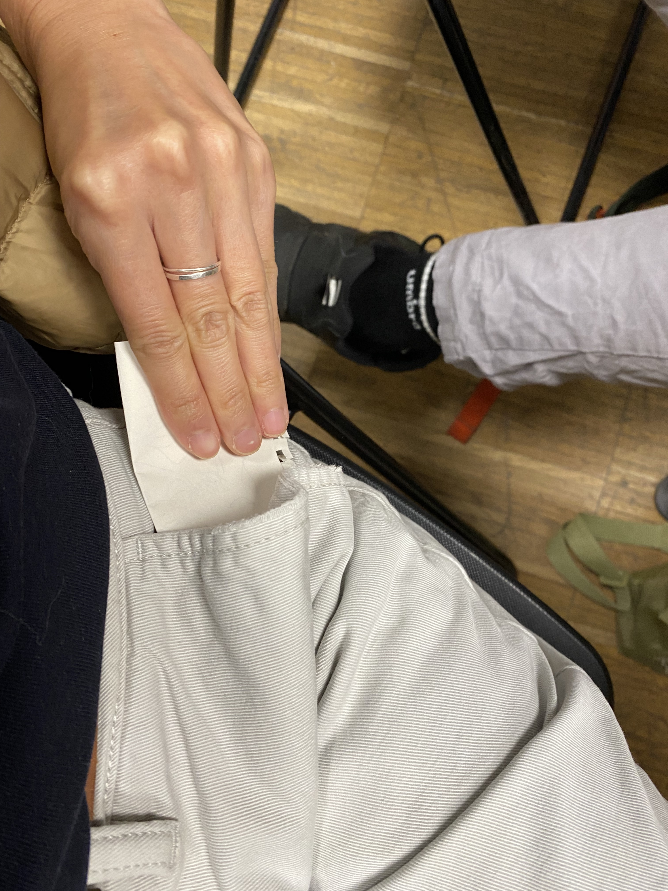
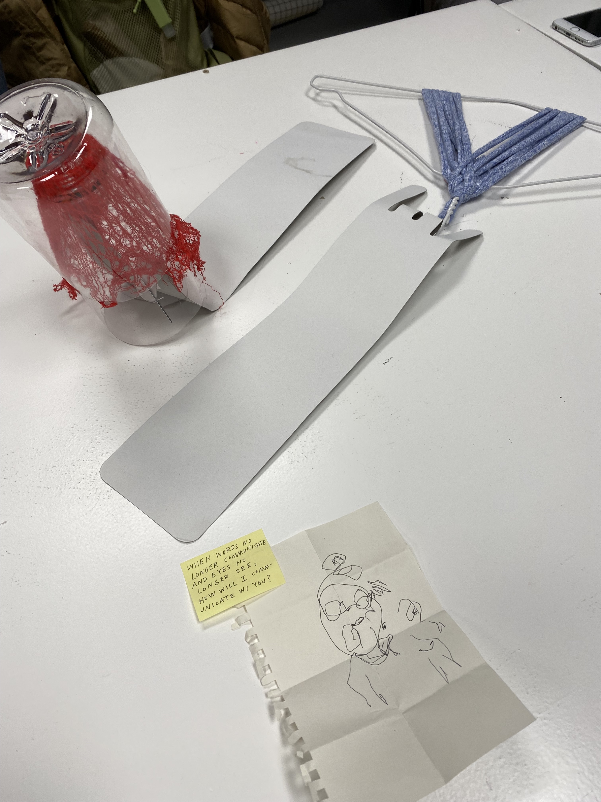

---
hide:
    - toc
---

# Living with Your Own Ideas
*Week 5 / 02-05 November 2021 / Oscar Tomico , Kristina Andersen, Angella Mackey*

## Workshop
1. Take one minute to draw a self portait on a small piece of paper. Then fold the paper and put it in your pocket.
2. Make something out of the scrap materials I brought to class for the person I drew. It can be for any function.

## Reflections
We started working with materials before having an idea of what it would become. I had explored this mode of making before (in undergrad and in my design residency) and felt comfortable and ready to jump in.

A few of the scrap materials I brought were: fabric yarn, clothes hangar, a net bag used to hold bell peppers from the grocery store, cardboard, a plastic bottle, and tea bags [*Fig.1*]. I gravitated towards the net bag and the fabric because they were flexible (and colorful) materials and I started wrapping them around different objects [*Fig.4*]. I enjoyed how the flexible materials were able to shift forms and create variations within the same object. I decided to focus on this element of "variations" in output with a common input.

I reflected of the 1 minute self portrait I had drawn, which I drew with my non-dominant hand and my eyes closed (so I can better connect with my true self, and also because I can't see myself anyways). The outcome of this drawing was a rough outline of my head with all of my features (eyes, nose, and mouth) drawn outside of my head [*Fig.2*]. I decided this person didn't use speech or sight to communicate, and that I needed to build a tool for them to communicate with touch.

In the end, I came up with two simple tools: the first one using the red net, paper clip, and a plastic bottle, and the second one using a clothes hanger and fabric yarn [*Fig.5*]. Both of these objects you can interact with and transform the shape of the materials in different degrees and variations, similar to variations in sound for speech. Within my system, tactile variations of the object will determine the message I was communicating. For example, depending on how far the clothes hangar was stretched and how far the yarns are spaced out, it would communicate a message.

We also realized as a group, our machines each touched upon a different human sense [*Fig.6*]. Unfortunately, we were the last group to present and Kristina didn't have much time to give feedback. But in her short time, she observed themes our group had in common were "becoming" and "unfinished explorations". I resonated with this comment because what we had made seemed to reflect our aspirations more than a tool that would be useful.

*Figure 1*

*Figure 2*

*Figure 3*

*Figure 4*

*Figure 5*

*Figure 6*

*Figure 7*
