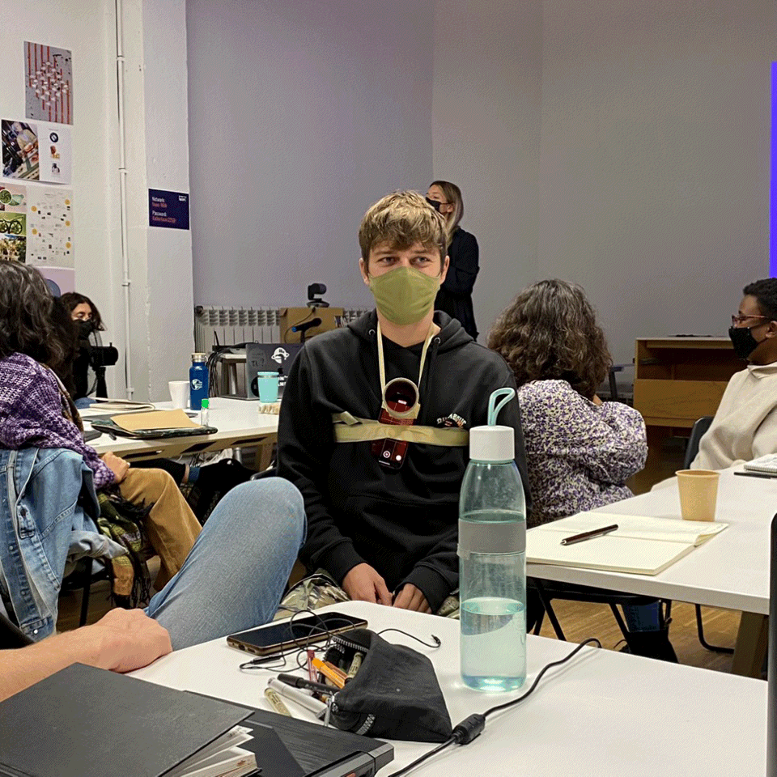

---
hide:
    - toc
---

# Documentation Beyond Presentation
*Week 6 / 08 November 2021 / Kate Armstrong*

*Nikita's documenting device*

### New Way of Documenting
*A reflection on how you are documenting and communicating your work currently, and how you will approach this moving forward in the master.*

Unfortunately, documenting my work has become an afterthought during these first few months of the program. I've been deeply engaged in learning new things and haven't found a great way to integrate documentation into my process. I have been taking photographs as I remember to, and try to do it quickly so I don't disturb the flow of the activity. But when I return to these photos at the end of the week for my reflections, I find they are inconsistent and require time to sort through to find a narrative structure. The same goes for my end of the week reflections on my website. I realize there's a disconnect between my weekly experiences and my documentation and communication of them.

Moving forward, I would like to create a documenting system that is consistent and non-disruptive while representing my process in a way that feels authentic to me. I will try and dedicate some time to experiment with a few methods to see which one resonates. Most importantly, the system has to work within my way of working (be intuitive) and also accessible to others. Some of these experiments in documentation might be interesting, but prove to not be practical. Only one way to find out -- I will try the following methods to document my process during the Tech beyond the Myth course (these may change):

1. Making voice recordings to my future self (questions, discoveries, uncertainties)
2. Quick blind drawings with clear labels
3. Taking a photo every hour paired with a sound recording every hour (somehow automated)

